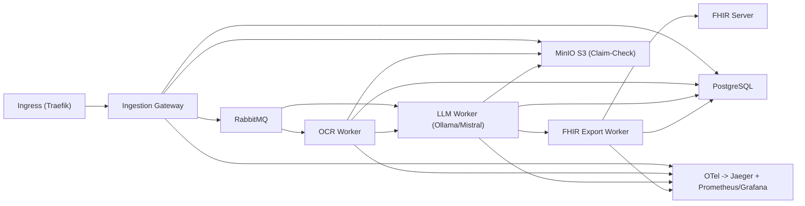

# FhirBridgeAI CTO Pitch Deck Script (2026-03-09)

## Slide 1 - Title
**FhirBridgeAI: Zero-Trust Clinical Document Pipeline for KRITIS**

Speaker track (15s):
- Wir automatisieren medizinische Dokumentverarbeitung in einer strikt on-prem Umgebung.
- Fokus: PHI-Schutz, Ausfallsicherheit und nachvollziehbare Architekturentscheidungen.

## Slide 2 - Problem / Business Value
**KRITIS pain:** Klinische Dokumente sind langsam, fragmentiert und compliance-kritisch.

Speaker track (25s):
- Relevante Daten stecken in PDFs, Texten und Legacy-Formaten.
- Manuelle Prozesse sind fehleranfaellig und teuer.
- FhirBridgeAI reduziert Durchlaufzeit und schafft auditierbare, maschinenlesbare FHIR-Ergebnisse.

## Slide 3 - Ist-Architektur (production-realistic)

Speaker track (35s):
- Asynchrones Design entkoppelt Lastspitzen.
- Claim-Check sichert grosse Payloads in S3, Queue enthaelt nur Referenzen.
- End-to-End Observability ist first-class, nicht nachtraeglich.

## Slide 4 - Zero-Trust and PHI Protection
**Design principles:**
- JWT-basierte Rollenpruefung (klinische Rollenpflicht)
- Fail-closed Media-Type und Auth-Gates
- PHI-safe Logging (keine Klartext-Patientendaten)
- Pseudonymisierung vor LLM-Verarbeitung

Speaker track (30s):
- Die Architektur ist so gebaut, dass ein Fehler standardmaessig stoppt, nicht durchrutscht.
- Sicherheit ist in den Kontrollfluss eingebaut, nicht nur in Policies dokumentiert.

## Slide 5 - Reliability and Recovery
**Resilience controls:**
- durable queues
- retry + DLQ-faehige Patterns
- kompensierende S3-Cleanup-Pfade gegen Orphan Data
- fail-fast startup checks fuer kritische DB-Zustaende

Speaker track (25s):
- Ziel ist nicht nur "funktioniert", sondern "funktioniert unter Stress und bei Teilfehlern".

## Slide 6 - Live Demo Story (3 min)
1. Dokument einspeisen (`/ingest/text` oder `/ingest/pdf`)
2. Queue + Worker-Verarbeitung beobachten
3. Trace in Jaeger verfolgen
4. FHIR-Output und Statuspersistenz zeigen

Speaker track (45s):
- Kein Code-Scrolling.
- Nur operative Beweise: Traces, Metriken, reproduzierbare Request/Response-Kette.

## Slide 7 - Validation Snapshot
**Aktueller Lauf (dieser Termin):**
- `pytest`: 31 passed
- Live OpenAPI: `/ingest/pdf`, `/ingest/text`
- Zero-Trust check: ohne Bearer Token -> `401`

Speaker track (20s):
- Das ist nicht theoretisch; wir validieren sowohl Unit-Level als auch Laufzeitverhalten.

## Slide 8 - Why This Matters for Engineering Leadership
- kuerzere Incident-Dauer durch Tracing
- weniger manueller Aufwand im klinischen Backoffice
- nachvollziehbare Architektur statt Black-Box Skripte

Speaker track (20s):
- Der Nutzen liegt in Stabilitaet, Nachweisbarkeit und Betriebskosten.

## Slide 9 - Honest Roadmap
**Near-term:**
- Vollstaendige CI gates (black/ruff/mypy) auf gruen bringen
- Testabdeckung auf Ingestion/Auth-Livepfade ausbauen

**Optional evolution path:**
- Kafka fuer sehr hohe Event-Last
- Qdrant fuer semantische Retrieval-Szenarien

Speaker track (25s):
- Wir pitchen den Ist-Zustand ehrlich und zeigen die naechste skalierbare Ausbaustufe.

## Slide 10 - Ask
**15-minute architecture deep dive**
- Target: konkrete Produktionsrisiken in der Zielumgebung identifizieren
- Outcome: priorisierte Integrationsschritte mit Aufwand/Nutzen

Speaker track (15s):
- Ich komme nicht mit Buzzwords, sondern mit einem belastbaren Betriebsmodell.

---

## One-line opener for CTO outreach
"I built a zero-trust, event-driven on-prem clinical AI pipeline that can prove traceability, PHI safety, and failure recovery under load. If your team is scaling regulated AI workloads, I can show a 3-minute operational proof." 
