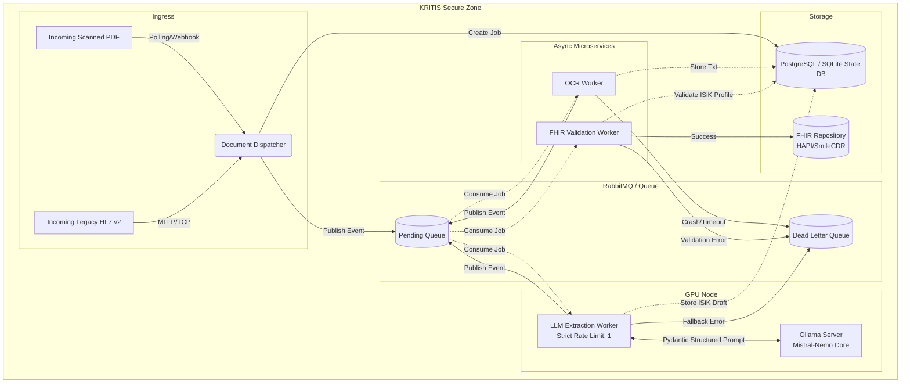

# FhirBridgeAI Architecture overview

This document describes the Phase 3 / Phase 4 enterprise architecture for the FhirBridgeAI platform, emphasizing KRITIS (Privacy-Preserving AI) compliance, asynchronous processing, and strict data validation (FHIR/ISiK).

## End-to-End Pipeline

The system is designed as an asynchronous, event-driven microservice architecture. To prevent starving the queue while avoiding GPU overload on local AI models, it leverages horizontal scaling of OCR nodes and strict vertical queuing for the Local LLM.

## Core Components

### 1. Document Dispatcher

Acts as the ingress controller. It accepts raw HL7 v2 pipes or scanned PDFs, creates a central state record in the Database, and enqueues the initial processing event.

- **Relevant Skills**: `parsing-hl7v2-messages`, `building-autonomous-dispatchers`

### 2. Message Broker & State DB

The backbone of the architecture. A SQL Database (e.g. PostgreSQL) tracks exactly which stage (`OCR_PROCESSING`, `LLM_EXTRACTION`, etc.) a document is in. The Message Broker (RabbitMQ) decouples the workers so they can be scaled independently. The Queue includes Dead Letter Queues (DLQ) for failed jobs to be retried or audited.

- **Relevant Skills**: `building-autonomous-dispatchers`

### 3. OCR Worker

A horizontally scalable worker that converts scanned PDFs into clean text representations. It does not hit the LLM.

- **Relevant Skills**: `extracting-medical-ocr`

### 4. LLM Worker (The AI Layer)

The most computationally expensive node. It runs a single-threaded loop against the local Ollama instance to ensure the GPU does not encounter Out-Of-Memory (OOM) errors. It parses the OCR text and heavily structures the output directly into Pydantic models.

- **Relevant Skills**: `integrating-local-llms`, `generating-fhir-models`

### 5. FHIR Validation Worker & Export

Validates the Pydantic models against strict German ISiK (Telematikinfrastruktur) API profiles before finally pushing the bundle to the hospital's central FHIR store (e.g., local `hapi-fhir` container or upstream SmileCDR). Uses the asynchronous RabbitMQ queue and DLX for resilient retries if the sink is unavailable during startup.

- **Relevant Skills**: `generating-fhir-models`

## Security & Data Sovereignty

By employing a strictly local LLM architecture via Ollama, NO patient health information (PHI) ever leaves the hospital's intranet (`KRITIS Secure Zone`). All APIs enforce zero-trust policies inside the network.

### Zero-Trust Data Privacy Layer (Claim-Check Vault)

Before processing raw input with the AI, the OCR node strictly pseudonymizes any PHI into deterministic generic tokens (e.g. `<NAME_1>`). The bidirectional mapping to these tokens is stored independently in a secure MinIO S3 bucket (Claim-Check Vault) instead of flowing through the message bus. The FHIR sink node utilizes this Vault to securely rehydrate the bundle before dispatching it to the Hospital Record layer, subsequently deleting the mapping (Zero-Trust Cleanup).

## Chaos Engineering & Resilience (Red Teaming)

To maintain Tier-1 Enterprise standards, the routing and queueing infrastructure is subject to automated Chaos Engineering. The architecture guarantees "Zero Data Loss" by persisting all state in PostgreSQL and using RabbitMQ Dead-Letter Exchanges for transient failures.
During stress-tests, simulated component outages (like stopping the FHIR Sink) must result in a mathematical equation confirming that `Total Injected == Success + Retry/DLQ`.

- **Relevant Skills**: `simulating-chaos-engineering`

## Observability & Distributed Tracing

End-to-end tracing is mission-critical for debugging decoupled asynchronous components. We rely on Jaeger and OpenTelemetry (OTLP) to trace across the entire system.
Because automatic instrumentation for asynchronous queues (like `aio_pika`) suffers from context loss, we enforce the **Manual Context Propagation Architecture**. Every worker must explicitly extract, attach, inject, and finally detach the trace context in its RabbitMQ consumer loop.

- **Relevant Skills**: `instrumenting-opentelemetry`

## Architectural Review Standards (The 5 Anti-Patterns)

To maintain Tier-1 Enterprise standards, all active agents (specifically when acting as a `system-reviewer`) must enforce the Principal Cloud Architect review guidelines. Code containing any of the following anti-patterns will be immediately rejected, requiring an "Architectural Override Implementation Plan" before proceeding:

1. **THE EVENT LOOP BLOCKER**: Synchronous network or I/O calls inside asynchronous Python code. (Exception: The Zero-Code Delay Pattern using Message TTL must be used instead of `asyncio.sleep` to inherently prevent this blocking behavior).
2. **THE STATEFUL SINNER**: Writing or reading local state to/from disk in scalable worker nodes (must use strict S3 Claim-Check with In-Memory Streams). Using in-memory consumer state for retries is also a violation; use RabbitMQ DLX expiration instead.
3. **THE SILENT FAILURE**: Discarded exceptions not tracked in OpenTelemetry or Dead-Letter-Queues.
4. **THE ORPHAN DATA**: Multi-step DB write operations without Saga/Distributed Transactions.
5. **THE NAKED ENDPOINT**: Processing requests without strict validation of authentication/authorization.
