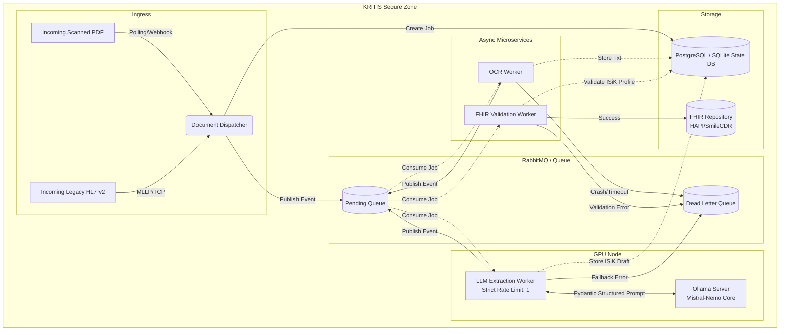

# FhirBridgeAI Architecture overview

This document describes the Phase 3 / Phase 4 enterprise architecture for the FhirBridgeAI platform, emphasizing KRITIS (Privacy-Preserving AI) compliance, asynchronous processing, and strict data validation (FHIR/ISiK).

## End-to-End Pipeline

The system is designed as an asynchronous, event-driven microservice architecture. To prevent starving the queue while avoiding GPU overload on local AI models, it leverages horizontal scaling of OCR nodes and strict vertical queuing for the Local LLM.

## Core Components

### 1. Document Dispatcher

Acts as the ingress controller. It accepts raw HL7 v2 pipes or scanned PDFs, creates a central state record in the Database, and enqueues the initial processing event.

- **Relevant Skills**: `parsing-hl7v2-messages`, `building-autonomous-dispatchers`

### 2. Message Broker & State DB

The backbone of the architecture. A SQL Database (e.g. PostgreSQL) tracks exactly which stage (`OCR_PROCESSING`, `LLM_EXTRACTION`, etc.) a document is in. The Message Broker (RabbitMQ) decouples the workers so they can be scaled independently. The Queue includes Dead Letter Queues (DLQ) for failed jobs to be retried or audited.

- **Relevant Skills**: `building-autonomous-dispatchers`

### 3. OCR Worker

A horizontally scalable worker that converts scanned PDFs into clean text representations. It does not hit the LLM.

- **Relevant Skills**: `extracting-medical-ocr`

### 4. LLM Worker (The AI Layer)

The most computationally expensive node. It runs a single-threaded loop against the local Ollama instance to ensure the GPU does not encounter Out-Of-Memory (OOM) errors. It parses the OCR text and heavily structures the output directly into Pydantic models.

- **Relevant Skills**: `integrating-local-llms`, `generating-fhir-models`

### 5. FHIR Validation Worker

Validates the Pydantic models against strict German ISiK (Telematikinfrastruktur) API profiles before finally pushing the bundle to the hospital's central FHIR store.

- **Relevant Skills**: `generating-fhir-models`

## Security & Data Sovereignty

By employing a strictly local LLM architecture via Ollama, NO patient health information (PHI) ever leaves the hospital's intranet (`KRITIS Secure Zone`). All APIs enforce zero-trust policies inside the network.
